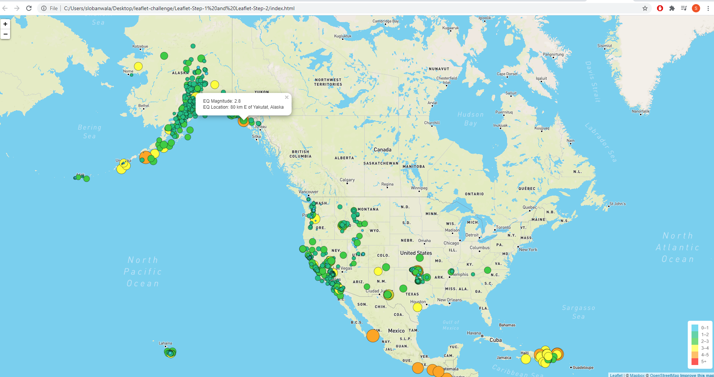
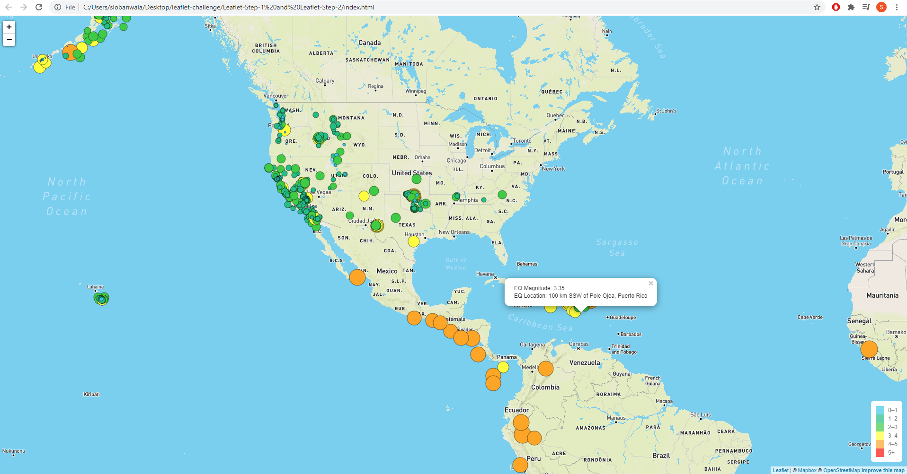

# leaflet-challenge

In this homework we used d3 to traverse through JSON data from an api, and then plot it in leaflet js

The link to the github repo is:

# https://github.com/slobanwala1/leaflet-challenge

Instructor readme link:

# https://github.com/slobanwala1/leaflet-challenge/blob/main/Leaflet-Step-1%20and%20Leaflet-Step-2/README.md

Here is a few pics of Leaflet-Step-1 fully working:

**Img 1**

 
 

**Img 2**

 
 

The difficult part for this homework was setting up the map. Also understanding how to differentiate between magnitudes. We had to create separate functions for
these to be handled. Next is understanding how the API works with our mapbox credentials, as I looked through old class notes and realized that the mapbox API
is used to generate the full map/background map, and the API for earthquakes is used in the d3 portion to read the JSON in. With all these pieces the puzzle
was finally forming and as they fell in place, the homework became more tangible and easier to visualize and understand. The legend was easy to setup but getting
the colors to display with each value its designated was a little tough until stack overflow helped with using the CSS for that. Thank you for letting us work with such vibrant JS libraries to see such cool maps and legends in action.
